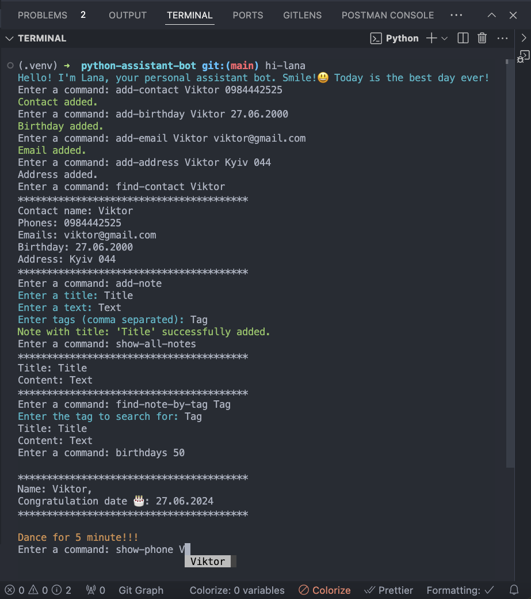
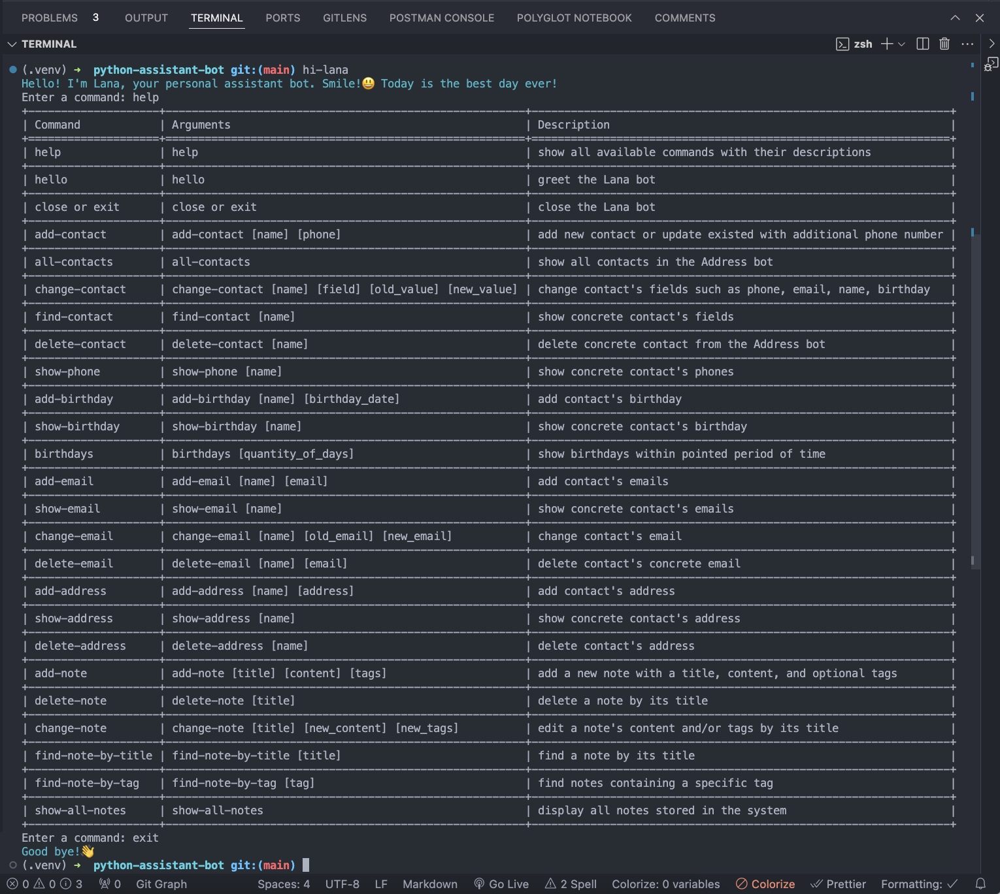

# Personal Assistant Bot Lana

## To run the bot, please install the following packages:

1. `pip install setuptools`
2. `pip install prompt_toolkit`
3. `pip install colorama`
4. `pip install tabulate`
5. `pip install -e .`

## Start bot command: hi-lana

## 📴 Commands list:

### 🔅 General commands

| Command       | Arguments    | Description                        |
| ------------- | ------------ | ---------------------------------- |
| hello         | no arguments | greet the Lana Bot                 |
| help          | no arguments | show all commands with description |
| close or exit | no arguments | stop the Lana Bot                  |

### 🙍 Manage by Contacts

| Command        | Arguments                                             | Description                                                    |
| -------------- | ----------------------------------------------------- | -------------------------------------------------------------- |
| add-contact    | add-contact [name] [phone]                            | add new contact or update existed with additional phone number |
| all-contacts   | all-contacts                                          | show all contacts in the Address bot                           |
| change-contact | change-contact [name] [field] [old_value] [new_value] | change contact's fields such as phone, email, name, birthday   |
| find-contact   | find-contact [name]                                   | show concrete contact's fields                                 |
| delete-contact | delete-contact [name]                                 | delete concrete contact from the Address bot                   |

### ☎️ Manage by Phone

| Command    | Arguments         | Description                    |
| ---------- | ----------------- | ------------------------------ |
| show-phone | show-phone [name] | show concrete contact's phones |

### 🎂 Manage by Birthday

| Command       | Arguments                           | Description                                  |
| ------------- | ----------------------------------- | -------------------------------------------- |
| add-birthday  | add-birthday [name] [birthday_date] | add contact's birthday                       |
| show-birthday | show-birthday [name]                | show concrete contact's birthday             |
| birthdays     | birthdays [quantity_of_days]        | show birthdays within pointed period of time |

### ✉️ Manage by Email

| Command      | Arguments                   | Description                     |
| ------------ | --------------------------- | ------------------------------- |
| add-email    | add-email [name] [email]    | add contact's emails            |
| show-email   | show-email [name]           | show concrete contact's emails  |
| delete-email | delete-email [name] [email] | delete contact's concrete email |

### 📭 Manage by Address

| Command        | Arguments                    | Description                     |
| -------------- | ---------------------------- | ------------------------------- |
| add-address    | add-address [name] [address] | add contact's address           |
| show-address   | show-address [name]          | show concrete contact's address |
| delete-address | delete-address [name]        | delete contact's address        |

### 🗒️ Manage by Notes

| Command            | Arguments                        | Description                                              |
| ------------------ | -------------------------------- | -------------------------------------------------------- |
| add-note           | [title] [content] [tags]         | Add a new note with a title, content, and optional tags. |
| delete-note        | [title]                          | Delete a note by its title.                              |
| change-note        | [title] [new_content] [new_tags] | Edit a note's content and/or tags by its title.          |
| find-note-by-title | [title]                          | Find a note by its title.                                |
| find-note-by-tag   | [tag]                            | Find notes containing a specific tag.                    |
| show-all-notes     |                                  | Display all notes stored in the system.                  |

`To continue filling out the note, press Enter after each input.`

## We use the following types of commits:

- Feat(PY) Added new functionality

- Fix(PY) Error correction

- Perf(PY) Changes to improve performance

- Refactor(PY) Code edits without fixing bugs or adding new features

- Revert(PY) Rollback to previous commits

- Style(PY) Code style edits

- Docs(MD) Documentation update

Choose from the list the description of the commit that fits your task, in brackets we write the file in which we worked, and in the body of the commit we write what we did (changed) etc.

### Project result

### Development team :

Viktor Svertoka **Team Lead**

Yevhenii Datsenko **Scrum Master**

Lesia Soloviova **Developer**

Alina Riabova **Developer**

Yuliia Nazymko **Developer**
